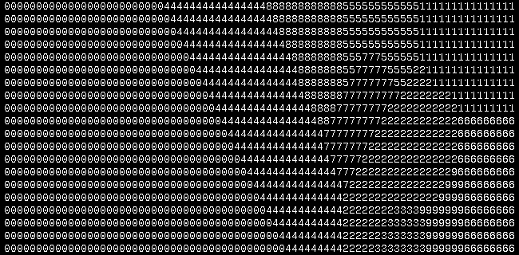
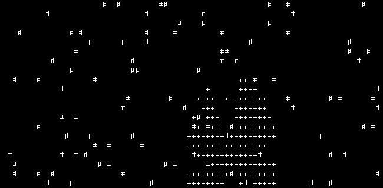
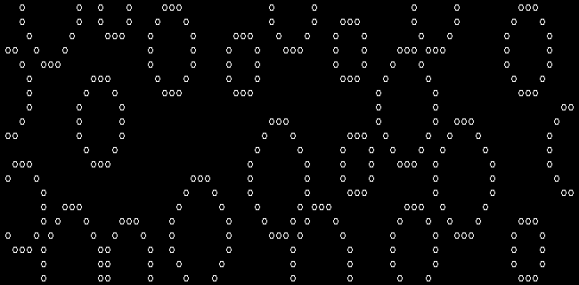
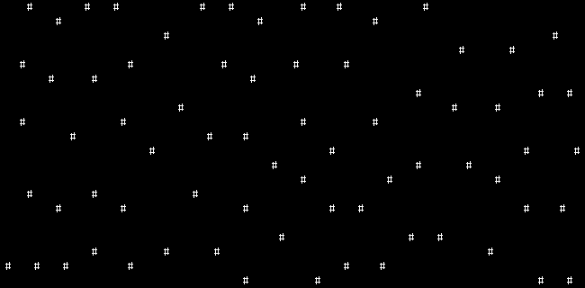
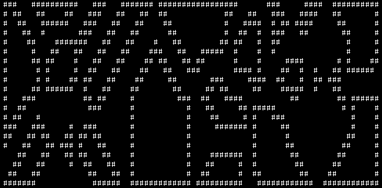

# *forma* example gallery
* [Binary space partitioning](#binary-space-partitioning)
* [Voronoi tessellation](#voronoi-tessellation)
* [Convex hull finder](#convex-hull-finder)
* [Perlin noise sampling](#perlin-noise-sampling)
* [Maximum rectangle finding](#maximum-rectangle-finding)
* [Raycasting](#raycasting)
* [Circle primitives](#circle-primitives)
* [Cellular automata](#cellular-automata)
* [Sampling methods](#sampling-methods)
* [Rasterising isolines](#rasterising-isolines)
* [Combining cellular automata rules](#combining-cellular-automata-rules)
* [Readme example](#readme-example)
* [Asynchronous cellular automata](#asynchronous-cellular-automata)

## Binary space partitioning

```lua
local primitives = require('forma.primitives')

-- Generate an 80x20 square and partition it into segments of maximally 50 cells
local square = primitives.square(80,20)
local bsp = square:bsp(50)

-- Print the BSP
bsp:print()
```
### Output

## Voronoi tessellation

```lua
local cell       = require('forma.cell')
local primitives = require('forma.primitives')

-- Generate a random pattern in a specified domain
local sq = primitives.square(80,20)
local rn = sq:sample(10)

-- Compute the corresponding voronoi tesselation
local measure  = cell.chebyshev
local segments = rn:voronoi(sq, measure)

-- Print the tesselation
segments:print()
```
### Output

## Convex hull finder
This generates a messy random pattern, and finds its convex hull.

```lua

local primitives   = require('forma.primitives')
local multipattern = require('forma.multipattern')

-- Generate a domain and a random set of points
local domain = primitives.square(80, 20)
local points = domain:sample(30)

-- Find the convex hull
local c_hull = points:convex_hull()
multipattern.new({domain, c_hull, points}):print({' ', 'x', 'o'})
```
### Output

## Perlin noise sampling
Here we sample a square domain pattern according to perlin noise,
generating three new patterns consisting of the noise thresholded at
values of 0, 0.5 and 0.7.

```lua

local primitives = require('forma.primitives')

local domain = primitives.square(80,20)
local frequency, depth = 0.2, 1
local thresholds = {0, 0.5, 0.7}
local noise  = domain:perlin(frequency, depth, thresholds)

-- Print resulting pattern segments
noise:print({'.', '+', 'o'}, domain)
```
### Output

## Maximum rectangle finding
This generates a messy random pattern, and finds the largest contiguous
rectangle of active cells within it.

```lua

local primitives = require('forma.primitives')
local multipattern = require('forma.multipattern')

-- Generate a domain and a messy 'blocking' pattern
local domain = primitives.square(80, 20)
local blocks = domain:sample(80)

-- Find the largest contiguous 'unblocked' rectangle in the base pattern
local mxrect = (domain-blocks):max_rectangle()

-- Print it nicely as a multipattern
multipattern.new({blocks, mxrect}):print({'o','#'}, domain)
```
### Output

## Raycasting
This generates a messy random blocking pattern, selects a random point
within it, and casts rays from that point to identify a 'visible' area.

```lua

local primitives   = require('forma.primitives')
local raycasting   = require("forma.raycasting")
local multipattern = require("forma.multipattern")

-- Generate a domain and a messy 'blocking' pattern
local domain = primitives.square(80, 20)
local blocks = domain:sample(100)
domain = domain - blocks

-- Cast rays in all direction from a random point in the domain
local traced = raycasting.cast_360(domain:rcell(), domain, 10)
multipattern.new({blocks, traced}):print({'#', '+'}, domain)
```
### Output

## Circle primitives

```lua
local cell         = require('forma.cell')
local pattern      = require('forma.pattern')
local primitives   = require('forma.primitives')
local multipattern = require('forma.multipattern')

local max_radius = 4

-- Setup domain and some random seeds
local domain = primitives.square(80,20)
local seeds  = domain:sample_poisson(cell.euclidean, 2*max_radius)
local shapes = pattern.new()

-- Randomly generate some circles in the domain
for seed in seeds:cells() do
    local circle = primitives.circle(math.random(2, max_radius))
    shapes = shapes + circle:translate(seed.x, seed.y)
end

multipattern.new({shapes}):print({'o'}, domain)

```
### Output

## Cellular automata
Demonstration of classic cellular-automata cave generation (4-5 rule).

```lua
local primitives    = require('forma.primitives')
local automata      = require('forma.automata')
local neighbourhood = require('forma.neighbourhood')
local multipattern  = require('forma.multipattern')

-- Domain for CA
local sq = primitives.square(80,20)

-- CA initial condition: sample at random from the domain
local ca = sq:sample(800)

-- Moore neighbourhood 4-5 rule
local moore = automata.rule(neighbourhood.moore(), "B5678/S45678")
local ite, converged = 0, false
while converged == false and ite < 1000 do
    ca, converged = automata.iterate(ca, sq, {moore})
    ite = ite+1
end

-- Print to stdout
multipattern.new({ca}):print({'#'}, sq)
```
### Output

## Sampling methods
Demonstrations of various methods for sampling from a pattern.
1. `pattern.sample` generates white noise, it's fast and irreguarly distributed.
2. Lloyd's algorithm when a specific number of uniform samples are desired.
3. Mitchell's algorithm is a good (fast) approximation of (2).
3. Poisson-disc when a minimum separation between samples is the only requirement.

```lua

local cell          = require('forma.cell')
local primitives    = require('forma.primitives')
local multipattern  = require('forma.multipattern')

-- Domain and seed
local measure = cell.chebyshev
local domain   = primitives.square(80,20)

-- Random samples, uncomment these turn by turn to see the differences
local random  = domain:sample_poisson(measure, 4)
--local random  = domain:sample_mitchell(measure, 100, 100)
--local random   = domain:sample(40)
--local _, random = domain:voronoi_relax(random, domain, measure)

multipattern.new({random}):print({'#'}, domain)
```
### Output

## Rasterising isolines
Here we generate a pattern randomly filled with points, and take as a scalar
field `N(cell) = F_2(cell) - F_1(cell)`, where `F_n` is the Chebyshev distance
to the nth nearest neighbour. Isolines at `N = 0` are drawn by thresholding `N`
at 1 and taking the interior hull.

```lua

local cell          = require('forma.cell')
local primitives    = require('forma.primitives')
local multipattern  = require('forma.multipattern')

-- Distance measure
local measure = cell.chebyshev

-- Domain and list of seed cells
local sq = primitives.square(80,20)
local rn = sq:sample(20):cell_list()

-- Worley noise mask
local mask = function(tcell)
    local sortfn = function(a,b)
        return measure(tcell, a) < measure(tcell, b)
    end
    table.sort(rn, sortfn)
    local F1 = measure(rn[1], tcell)
    local F2 = measure(rn[2], tcell)
    return F2 - F1  > 1
end

-- Compute the thresholded pattern and print its interior hull
local noise = sq:filter(mask)
multipattern.new({noise:interior_hull()}):print({'#'}, sq)

```
### Output

## Combining cellular automata rules
Here the way multiple CA rules can be combined into a single ruleset is
demonstrated. A asynchronous cellular automata with a complicated ruleset
generates an interesting 'corridor' like pattern.

```lua

local primitives    = require('forma.primitives')
local automata      = require('forma.automata')
local neighbourhood = require('forma.neighbourhood')

-- Generate a domain, and an initial state ca with one random seed cell
local domain = primitives.square(80,20)
local ca = domain:sample(1)

-- Complicated ruleset, try leaving out or adding more rules
local moore = automata.rule(neighbourhood.moore(),      "B12/S012345678")
local diag  = automata.rule(neighbourhood.diagonal_2(), "B01/S01234")
local vn    = automata.rule(neighbourhood.von_neumann(),"B12/S01234")
local ruleset = {vn, moore, diag}

repeat
    local converged
    ca, converged = automata.async_iterate(ca, domain, ruleset)
until converged

-- Print corridors to screen using box-building characters
local nbh = neighbourhood.von_neumann()
ca:neighbourhood_categories(nbh)
  :print(nbh:category_label(), domain)
```
### Output

## Readme example
This generates the example used in the readme. Runs a 4-5 rule CA for 'cave
generation and then computes the contiguous sub-patterns and prints them.

```lua

-- Load forma modules, lazy init is also available, i.e
-- require('forma')
local pattern       = require('forma.pattern')
local primitives    = require('forma.primitives')
local automata      = require('forma.automata')
local neighbourhood = require('forma.neighbourhood')

-- Generate a square box to run the CA inside
local domain = primitives.square(80,20)

-- CA initial condition: 800-point random sample of the domain
local ca = pattern.sample(domain, 800)

-- Moore (8-cell) neighbourhood 4-5 rule
local moore = automata.rule(neighbourhood.moore(), "B5678/S45678")

-- Run the CA until converged or 1000 iterations
local ite, converged = 0, false
while converged == false and ite < 1000 do
    ca, converged = automata.iterate(ca, domain, {moore})
    ite = ite+1
end

-- Access a pattern's cell coordinates for external use
for icell in ca:cells() do
    -- local foo = bar(icell)
    -- or
    -- local foo = bar(icell.x, icell.y)
end

-- Find all 4-contiguous connected components of the CA pattern
-- Uses the von-neumann neighbourhood to determine 'connectedness'
-- but any custom neighbourhood can be used)
local connected_components = ca:connected_components(neighbourhood.von_neumann())

-- Print a representation to io.output
connected_components:print(nil, domain)

```
### Output

## Asynchronous cellular automata
Here the use of an asynchronous cellular automata is demonstrated, making
use also of symmetrisation methods to generate a final, symmetric pattern.

```lua

local pattern       = require('forma.pattern')
local primitives    = require('forma.primitives')
local automata      = require('forma.automata')
local neighbourhood = require('forma.neighbourhood')

-- Domain for CA to operate in
local sq = primitives.square(10,5)

-- Make a new pattern consisting of a single random cell from the domain
local start_point = sq:rcell() -- Select a random point
local ca_pattern  = pattern.new():insert(start_point.x, start_point.y)

-- Moore neighbourhood rule for CA
local moore = automata.rule(neighbourhood.moore(), "B12/S012345678")

-- Perform asynchronous CA update until convergence
local converged = false
while converged == false do
    ca_pattern, converged = automata.async_iterate(ca_pattern, sq, {moore})
end

-- Add some symmetry by mirroring the basic pattern a couple of times
local symmetrised_pattern = ca_pattern:hreflect()
symmetrised_pattern = symmetrised_pattern:vreflect():vreflect()
symmetrised_pattern = symmetrised_pattern:hreflect():hreflect()

-- Categorise the pattern according to possible vN neighbours and print to screen
-- This turns the basic pattern into standard 'box-drawing' characters
local vn = neighbourhood.von_neumann()
symmetrised_pattern:neighbourhood_categories(vn)
                   :print(vn:category_label())
```
### Output

